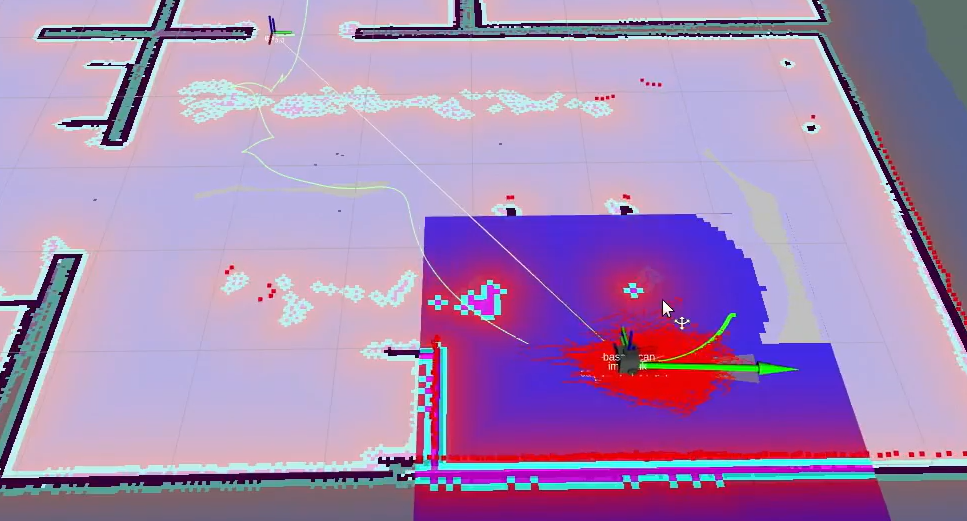

# ros-rob-project-mapping
Repo for Robotrendszerek laboratórium project #2022-23/II

## Project description
- Navigation stack tuning in complex simulation environments
- Mapping a complex room/building and autonomous navigation using the navigation stack
- Simulation of moving obstacles (e.g. humans, animals)


<a href="https://drive.google.com/file/d/1upHrw3OPzft92lK2e8xXOTXydcQiQ1aS/view?usp=sharing"></a>

## Setup and install
1. **Clone repository and update submodules**
    ```
    mkdir -p workspace/src
    cd workspace/src
    git clone https://github.com/turtlewizard73/pie-mapping-and-navigation.git
    ```

2. **Checkout on development and update submodules**
    ```
    cd src/pie-mapping-and-navigation
    git fetch
    git checkout development
    git pull
    git submodule update --init --recursive
    ```

3. **Build gazebo actors plugin**
    ```
    cd gazebo_actor_collisions_plugin
    mkdir build
    cd build
    cmake ..
    make
    export GAZEBO_PLUGIN_PATH=$GAZEBO_PLUGIN_PATH:$(pwd)
    ```

4. **Install dependencies and build the packages**
    ```
    cd workspace/src/pie-mapping-and-navigation
    sudo xargs -a apt-dependencies.txt apt install -y
    cd workspace
    catkin_make
    source devel/setup.bash
    ```

## How to use
1. **start the simulation** (gazebo & rviz)
    ```
    roslaunch pie_bringup bringup.launch
    ```

2. **moving the robot**
    ```
    rosrun teleop_twist_keyboard teleop_twist_keyboard.py
    ```

3. **mapping**
    - start mapping
    ```
    roslaunch pie_bringup gmapping.launch
    ```
    - save map:
    ```
    rosrun map_server map_saver -f map
    ```

4. **navigation**
    ```
    roslaunch pie_bringup navigation.launch
    ```

## Main launch files:
1. bringup.launch
    - parameters:
        - rvizconfig: rviz config file
        - world: world to use in simulation
        - map_file: map file to upload onto map server
        - x_pos, y_pos, z_pos, yaw_pos: positions to spawn the robot in and also used az initial pose with amcl
    - launch includes:
        - simulation.launch
        - navigation.launch
    - nodes:
        - rviz
        - [interactive marker twist server](http://wiki.ros.org/interactive_marker_twist_server)
        - [hector trajectory server](http://wiki.ros.org/hector_trajectory_server)
        - [map server](http://wiki.ros.org/map_server)

2. simulation.launch
    - parameters:
        - world: world to use in simulation
        - visualize_laser: set gazebo visualization
        - use_camera: loads the camera xacro file at startup if selected
        - visualize_camera: set gazebo visualization
        - use_rgbd_camera: loads the depth camera xacro file at startup if selected
        - visualize_rgbd_camera: set gazebo visualization
        - x_pos, y_pos, z_pos, yaw_pos: positions to spawn the robot in and also used az initial pose with amcl
    - launch includes:
        - gazebo_ros empty_world.launch
    - nodes:
        - [robot_state_publisher](http://wiki.ros.org/robot_state_publisher)
        - [joint_state_publisher](http://wiki.ros.org/joint_state_publisher)
        - gazebo_ros spawn_urdf
        - [robot_pose_ekf](http://wiki.ros.org/robot_pose_ekf)

3. navigation.launch
    - nodes:
        - amcl
        - move_base
        - follow_waypoints

4. gmapping.launch
    - ndoes:
        - gmapping


